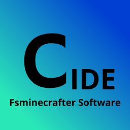

# CodeIt IDE 


A Client only code editor that uses pyodide to run python, basically a local web editor for python.
Although it does need python on the client to run the `luanch.py` script.

```
python3 luanch.py
```

This IDE can be runned in a server but its made to be a local / client editor.
